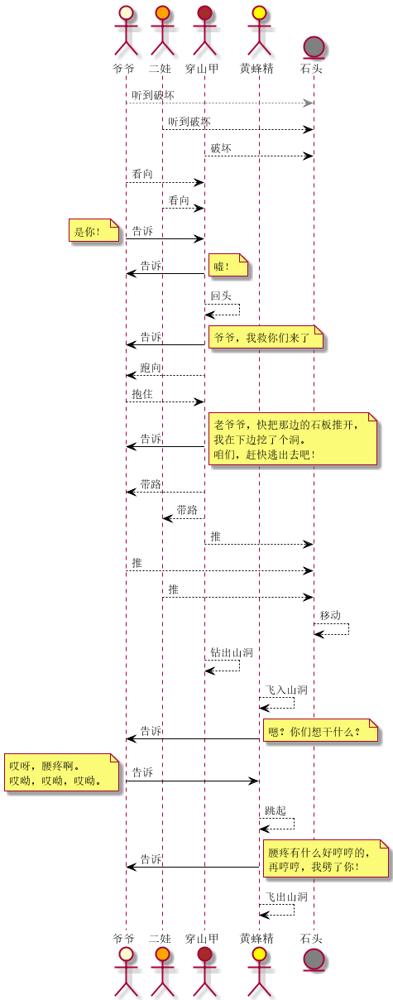

选取视频 https://www.bilibili.com/video/BV1zQ4y1d7dQ?p=5 中 0:37 ~ 1:30 的桥段
因为在这一段有较多心情变化

类型设计（建模）如下：


桥段场景如下：


得到运行结果：
```
爷爷听到石头在响
爷爷的心情从伤心变为惊讶
二娃听到石头在响
二娃的心情从伤心变为惊讶
穿山甲破坏石头，看到了爷爷搂着二娃
穿山甲的心情从焦急变为开心
石头被穿山甲破坏
穿山甲的心情从开心变为开心
爷爷惊讶地看向穿山甲
二娃惊讶地看向穿山甲
爷爷(惊讶) 对 穿山甲 说：“是你！”
穿山甲(开心) 从 爷爷 听到：“是你！”
穿山甲(开心) 对 爷爷 说：“嘘！”
爷爷(惊讶) 从 穿山甲 听到：“嘘！”
穿山甲回头看了一眼
穿山甲(开心) 对 爷爷 说：“爷爷，我救你们来了！”
爷爷(惊讶) 从 穿山甲 听到：“爷爷，我救你们来了！”
爷爷的心情从惊讶变为开心
穿山甲跑向爷爷
爷爷激动地抱住穿山甲
二娃的心情从惊讶变为开心
穿山甲的心情从开心变为认真
穿山甲(认真) 对 爷爷 说：“老爷爷，赶快把那边的石板推开，我在下边挖了个洞。咱们，赶快逃出去吧！”
爷爷(开心) 从 穿山甲 听到：“老爷爷，赶快把那边的石板推开，我在下边挖了个洞。咱们，赶快逃出去吧！”
穿山甲的心情从认真变为开心
穿山甲带领爷爷和二娃
爷爷跟着穿山甲
二娃跟着穿山甲
穿山甲推石头
爷爷推石头
二娃推石头
石头被 穿山甲 爷爷 二娃 推
石头被推动
穿山甲爬出山洞
黄蜂精飞入山洞
爷爷的心情从开心变为警觉
二娃的心情从开心变为警觉
黄蜂精(豪横) 对 爷爷 二娃 说：“嗯？你们想干什么？”
爷爷(警觉) 从 黄蜂精 听到：“嗯？你们想干什么？”
二娃(警觉) 从 黄蜂精 听到：“嗯？你们想干什么？”
爷爷的心情从警觉变为虚弱
爷爷(虚弱) 对 黄蜂精 说：“哎呀，腰疼啊。哎呦，哎呦，哎呦。”
黄蜂精(豪横) 从 爷爷 听到：“哎呀，腰疼啊。哎呦，哎呦，哎呦。”
黄蜂精跳起来
黄蜂精的心情从豪横变为愤怒
黄蜂精(愤怒) 对 爷爷 说：“腰疼有什么好哼哼的，再哼哼，我劈了你！”
爷爷(虚弱) 从 黄蜂精 听到：“腰疼有什么好哼哼的，再哼哼，我劈了你！”
黄蜂精飞出山洞
```