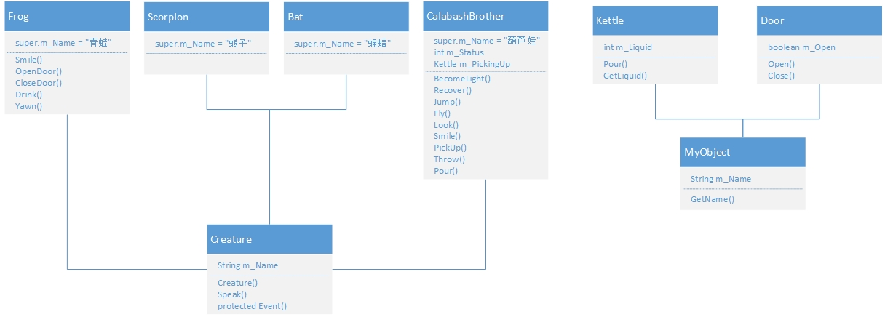
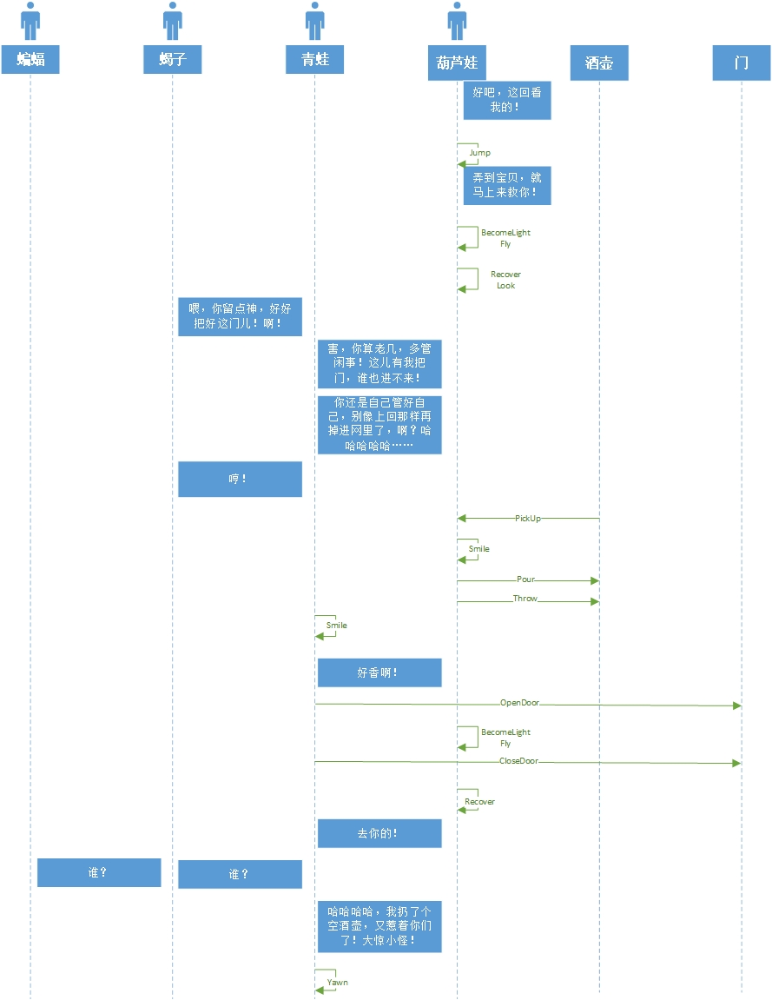

## Java - 第一次作业

#### 191220080 马英硕

选取视频 https://www.bilibili.com/video/BV1zQ4y1d7dQ?p=11 中 3:26 ~ 5:15 的桥段


类型设计与建模：




桥段场景：




运行结果：

```
 - 葫芦娃: "好吧，这回看我的！"
葫芦娃: 跳了一下
 - 葫芦娃: "弄到宝贝，就马上来救你！"
葫芦娃: 变成了光！
葫芦娃: 在空中游荡
葫芦娃: 还原成了葫芦兄弟
葫芦娃: 向门内偷窥
 - 蝎子: "喂，你留点神，好好把好这门儿！啊！"
 - 青蛙: "害，你算老几，多管闲事！这儿有我把门，谁也进不来！"
 - 青蛙: "你还是自己管好自己，别像上回那样再掉进网里了，啊？哈哈哈哈哈……" 
 - 蝎子: "哼！"
葫芦娃: 拿起了 紫色神壶
葫芦娃: 想到了什么，笑了笑
葫芦娃: 倒出了 紫色神壶 里的液体
葫芦娃: 放下了水壶
青蛙: 闻到了什么，很开心
 - 青蛙: "额啊，好香啊！"
青蛙: 打开了 超级大门
葫芦娃: 变成了光！
葫芦娃: 在空中游荡
青蛙: 关上了 超级大门
葫芦娃: 还原成了葫芦兄弟
青蛙: 从水壶 紫色神壶 里喝了一滴水
 - 青蛙: "去你的！"
 - 蝎子: "谁？"
 - 蝙蝠: "谁？"
 - 青蛙: "哈哈哈哈，我扔了个空酒壶，又惹着你们了！大惊小怪！"
青蛙: 打了个哈欠
```

